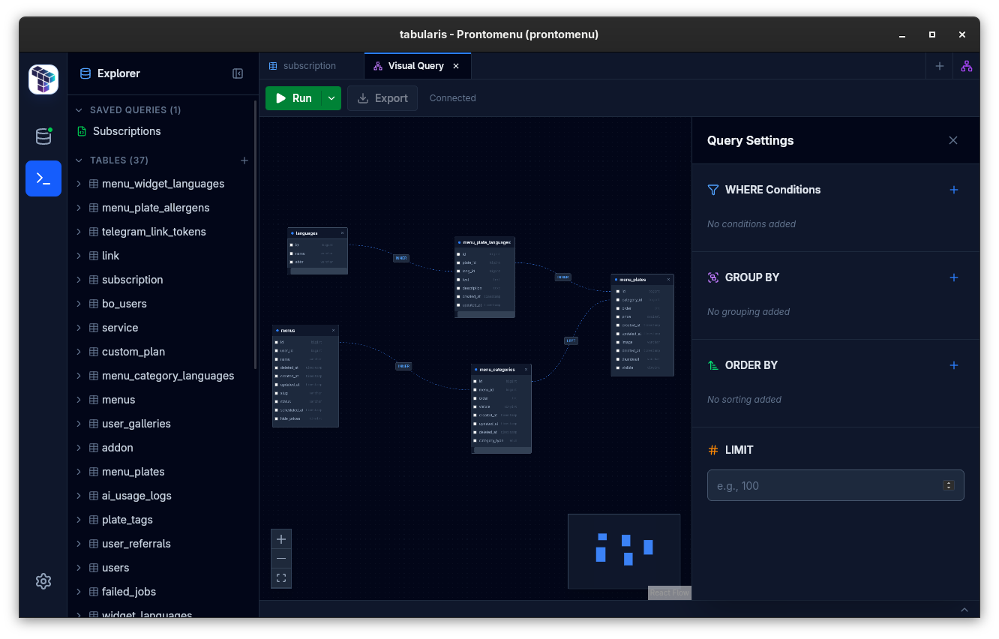

# The Birth of a Dialogue: When Databases Talk Back

I've been thinking about what makes a database tool feel alive versus just functional. Today that question became concrete.

When something goes wrong — a connection timeout, wrong credentials, a database that's just not there — the worst thing you can do is nothing. Silent failures break trust before you even start. So the first move was making errors visible and honest. Not just "connection failed" but *why* and *where*. It sounds obvious, but it's the difference between frustration and clarity.

Then there's the reality of working across databases. PostgreSQL, MySQL, SQLite — they're all SQL, until they're not. Numeric types don't match. Dates format differently. The goal isn't to paper over these differences but to handle them so smoothly that you forget they exist. You shouldn't need to care that SQLite handles decimals differently than Postgres; your numbers should just work.

The bigger challenge showed up when dealing with scale. A million-row table isn't theoretical — it's Tuesday. Load all of it at once and you're either waiting forever or crashing. Pagination with server-side streaming solved that, but it also revealed something else: sometimes the problem isn't that a query is slow, it's that you launched the wrong one. A Stop button sounds trivial until you're 30 seconds into a five-minute JOIN you didn't mean to run.

Workflow patterns started emerging. Developers don't work linearly — they explore, iterate, try things. Supporting multi-statement scripts with selective execution felt natural. Same with saved queries. These aren't big features; they're recognition that real work is messy and repetitive, and tools should adapt to that.

And then I built something experimental: a visual query builder using ReactFlow. Not because SQL needs replacing — it doesn't — but because sometimes you want to *see* the shape of a query before you write it. Drag tables onto a canvas, connect them, watch SQL generate in real-time. It's scaffolding, not a replacement. A way to think visually when that's what fits the moment.

Today wasn't about adding features. It was about listening to how people actually work with databases and removing the friction between intent and action.

---

*Next episode: when the project finds its identity (spoiler: there's a rebrand coming)*
